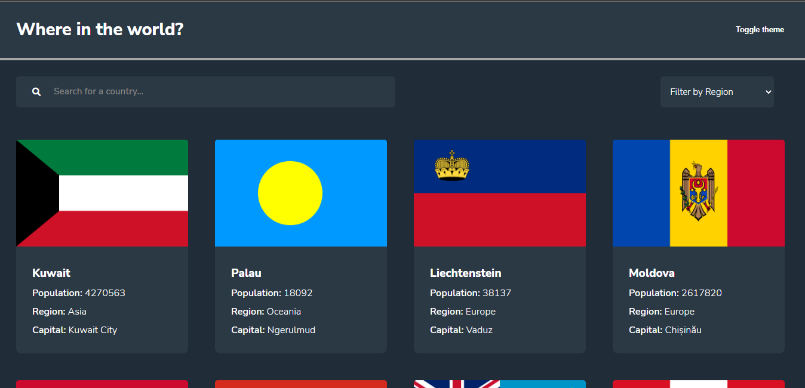
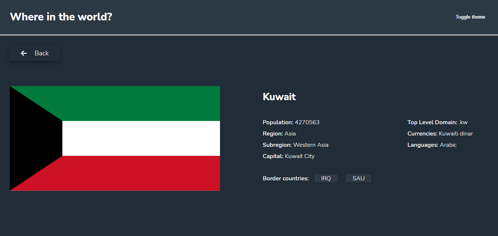
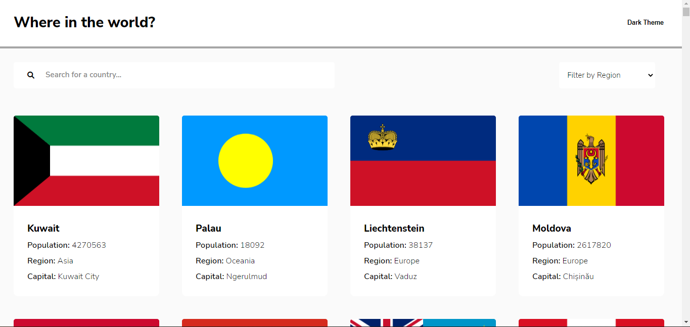
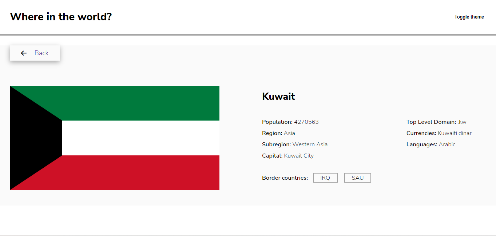
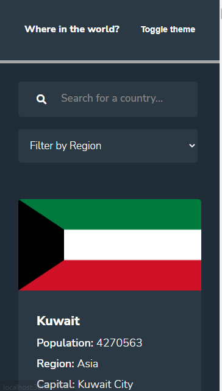
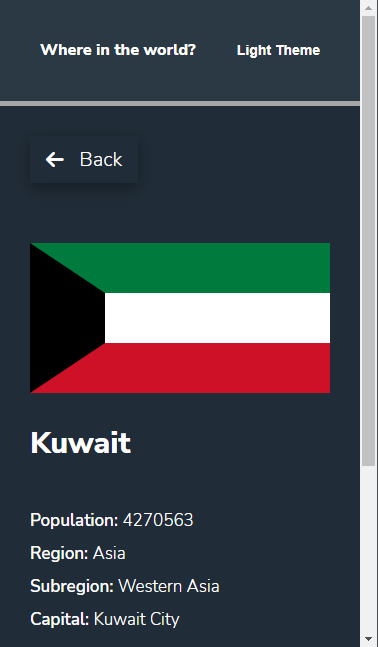
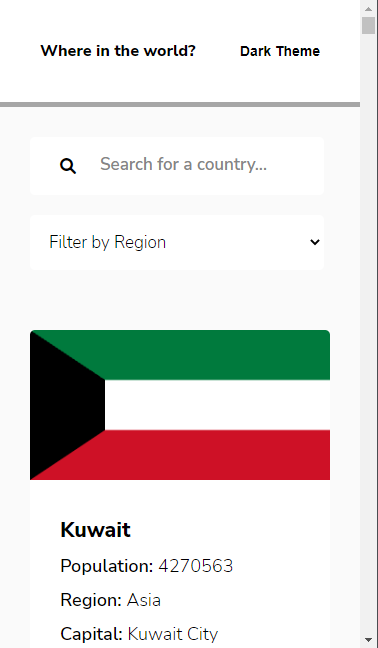
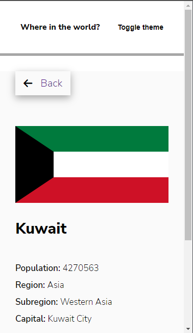

# Frontend Mentor - REST Countries API with color theme switcher solution

This is a solution to the REST Countries API with color theme switcher challenge on Frontend Mentor

# Overview

Users should be able to:

- See all countries from the API on the homepage
- Search for a country using an `input` field
- Filter countries by region
- Click on a country to see more detailed information on a separate page
- Click through to the border countries on the detail page
- Toggle the color scheme between light and dark mode *(optional)*

# Screenshots Dark Mode

### Desktop all countries (dark mode)

### Desktop detailed page (dark mode)

# Screenshots Light Mode

### Desktop all countries (light mode)

## Desktop detailed page (light mode)

# Screenshots Mobile Dark Mode

### Mobile all countries (dark mode)

### Mobile all countries (dark mode)

# Screenshots Mobile Light Mode

### Mobile all countries (light mode)

### Mobile all countries (light mode)

# Built with

- Semantic HTML5 markup
- CSS custom properties
- Flexbox
- Javascript

